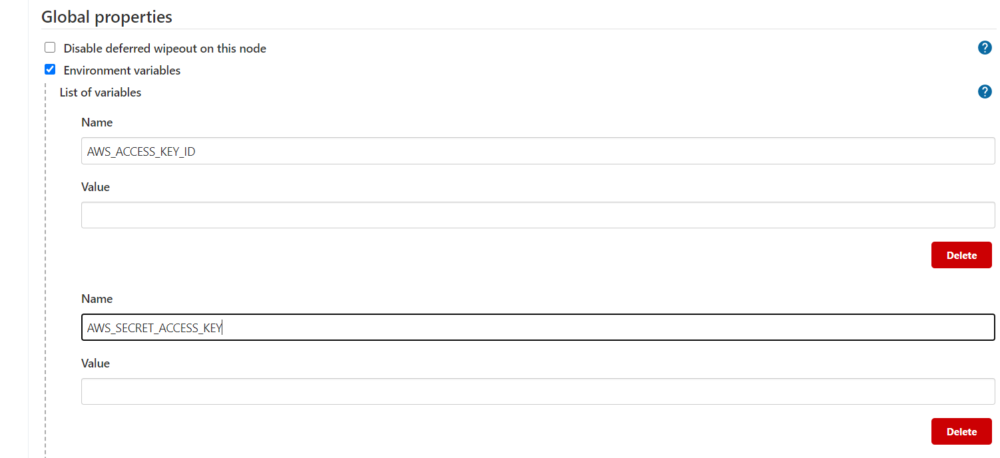

# Setting up a Functional CI / CD pipeline 

> 1. The first thing you need is a jenkins sever running in a public subnet. If you dont have that please refer to my github repo titled "jenkins-ec2". from the command line of your public server execute the following commands to get the follow softwares and set the rght permissons: * ALL this can be provided as UserData when starting up your ec2 instances *

* sudo yum install git -y
* sudo yum install python3 -y
* sudo amazon-linux-extras install docker -y 
* sudo yum install docker
* sudo service docker start
* sudo sytemctl enable dokcer
* sudo usermod -a -G docker jenkins

> 2. The second thing you need is a second server in a private subnet. this will rpresent different stages such as dev, pre-production, and production. again install the softwares and set up the right persmissons as show above. 

> 3. The next step is to access your jenkins server, using you_public_ip:8080. we theninstall the following plugins in our sever(Manage Jenkins -> Manage Plugins): 

* Docker Commons Plugin
* Docker Pipeline
* Docker plugin
* docker-build-step
* CloudBees Docker Build and Publish plugin
* SSH Agent

> 4. My pipeline and Test script is dependent on the boto3 SDK (software development kit) to access AWS resources. I had to enviromental variables, so that when Jenkis runs the our test script if can properly communicate with our AWS resources. The following is an example of how to set that up (go to Jenkins -> Manage Jenkins -> Configure System -> Global properties -> Environment variables)

> 5. our Pipeline will build and push dokcer images to a repository. inorder to do this we must provide jenkis creditianls to be able to do this in a  secure manner. We also must allow our jenkins 

> First we create the pipeline

https://stackoverflow.com/questions/44444099/how-to-solve-docker-permission-error-when-trigger-by-jenkins/44444163
https://serverfault.com/questions/883873/how-give-aws-credential-to-jenkins-pipeline
https://dzone.com/articles/building-docker-images-to-docker-hub-using-jenkins   
