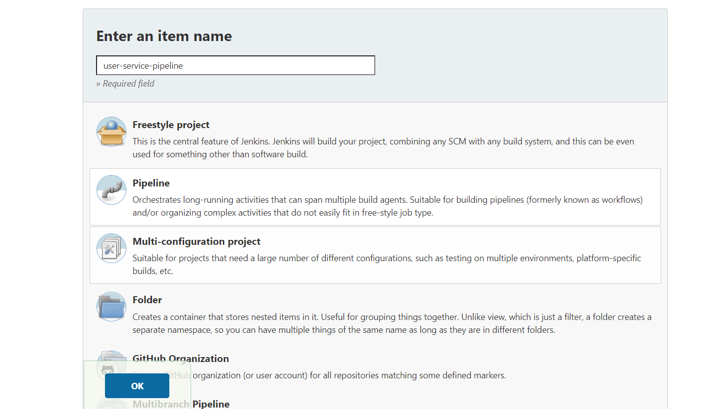
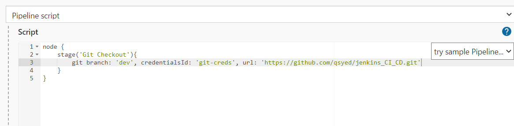
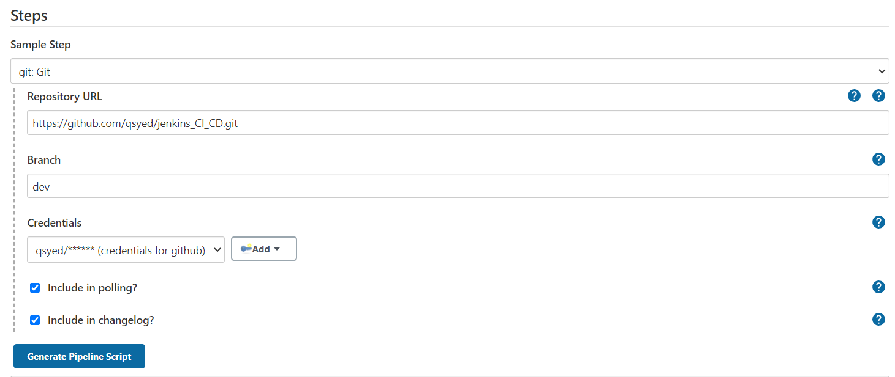
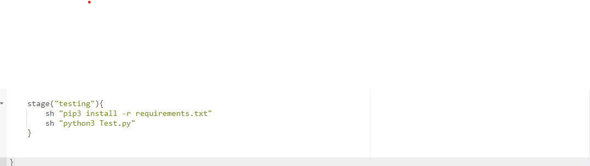

# Setting up a Functional CI / CD pipeline 

> The first thing you need is a jenkins sever running in a public subnet. If you dont have that please refer to my github repo titled "jenkins-ec2" 

> from the command line of your public server execute the following commands to get the follow softwares:
* sudo yum install git -y
* sudo yum install python3 -y
* sudo amazon-linux-extras install docker -y 
* sudo yum install docker
* sudo su -
* sudo service docker start
* sudo usermod -a -G docker ec2-user
* sudo su - ec2-user
* docker --version to confirm docker was installed
* git --version to confirm git was installed

> The second thing you need is a second server in a private subnet. this will rpresent different stages such as dev, pre-production, and production. 

> From your jenkins server create your pipeline. 

>from ther we will start to defining our pipeline stages 

* first stage git checkout:

> use the the pipeline syntax generator to help get the correct syntax 

> the next step is to add the testing stage like so:

