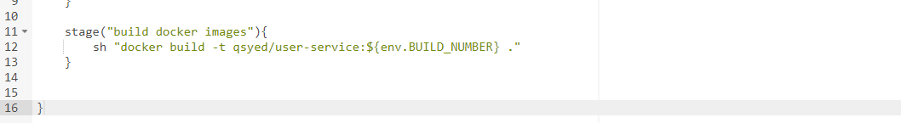
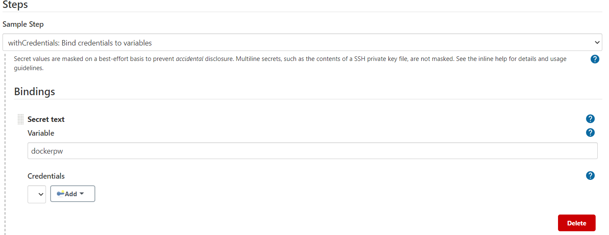
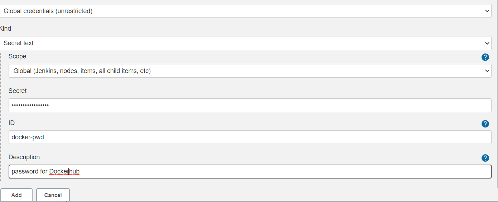

# Setting up a Functional CI / CD pipeline 

> The first thing you need is a jenkins sever running in a public subnet. If you dont have that please refer to my github repo titled "jenkins-ec2" 

> from the command line of your public server execute the following commands to get the follow softwares and set the rght permissons:

* sudo yum install git -y
* sudo yum install python3 -y
* sudo amazon-linux-extras install docker -y 
* sudo yum install docker
* sudo su -
* sudo service docker start
* sudo su - ec2-user
* sudo usermod -a -G docker ec2-user jenkins
* docker --version to confirm docker was installed
* git --version to confirm git was installed

> The second thing you need is a second server in a private subnet. this will rpresent different stages such as dev, pre-production, and production. 

> From your jenkins server create your pipeline. 

>from ther we will start to defining our pipeline stages 

* first stage git checkout:

> use the the pipeline syntax generator to help get the correct syntax 

> the next step is to add the testing stage like so:

> in our program we are using the boto3 SDK. we have to add enviromental variables so that our test work. the following is an example of how to set that up (go to Jenkins - Manage Jenkins - Configure System - Global properties - Environment variables)

> the next stage is building the docker image 

> After succesfully building the image we then need to push it to DockerHub so that we can have proper version control. To do this in a secure manner we will bind ourdocker-hub password to a variable. 

references: 

https://serverfault.com/questions/883873/how-give-aws-credential-to-jenkins-pipeline
https://stackoverflow.com/questions/44444099/how-to-solve-docker-permission-error-when-trigger-by-jenkins/44444163
