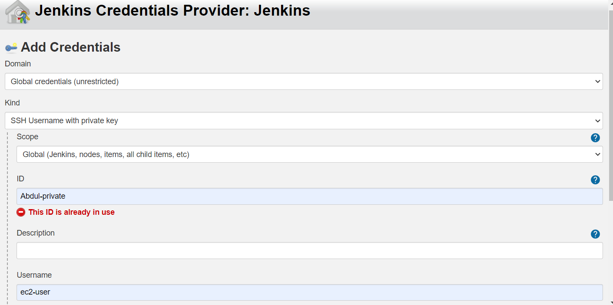

# Setting up a Functional CI / CD pipeline 

> 1. The first thing you need is a jenkins sever running in a public subnet. If you dont have that please refer to my github repo titled "jenkins-ec2". from the command line of your public server execute the following commands to get the follow softwares and set the rght permissons: 
 

**All these command can be provided as UserData when starting up your Ec2 instances**

* sudo yum install git -y
* sudo yum install python3 -y
* sudo amazon-linux-extras install docker -y 
* sudo yum install docker
* sudo service docker start
* sudo sytemctl enable dokcer
* sudo usermod -aG docker jenkins
* sudo usermod -aG docker ec2-user

 

> 2. The second thing you need is a second server in a private subnet. this will rpresent different stages such as dev, pre-production, and production. Again install the right softwares and dependencies:

 

**All these command can be provided as UserData when starting up your Ec2 instances**

* sudo yum install git -y
* sudo yum install python3 -y
* sudo amazon-linux-extras install docker -y 
* sudo yum install docker
* sudo service docker start
* sudo sytemctl enable dokcer
* sudo usermod -aG docker ec2-user

 

> 3. The next step is to access your jenkins server, using you_public_ip:8080. we theninstall the following plugins in our sever(Manage Jenkins -> Manage Plugins -> Avaialable): 

* Docker Commons Plugin
* Docker Pipeline
* Docker plugin
* docker-build-step
* CloudBees Docker Build and Publish plugin
* SSH Agent

 

> 4. My pipeline and Test script is dependent on the boto3 SDK (software development kit) to access AWS resources. I had to enviromental variables, so that when Jenkis runs the our test script if can properly communicate with our AWS resources. The following is an example of how to set that up (go to Jenkins -> Manage Jenkins -> Configure System -> Global properties -> Environment variables)

 

 

> 5. our Pipeline will build and push dokcer images to a docker hub repository. inorder to do this we must provide jenkis creditianls to be able to do this in a secure manner. We also must allow give our jenkins sever an shh connection to our private ec2. 

 

 

 

 

> 6. The next step is to create our pipeline. in our pipeline definition we will put the option for "pipeline script From SCM". For the SCM field we will use the option "git". Next we will give the repository url. NExt we will specify which branch. In my case i used the dev branch. Lastly we will specify that we have a jenkinsfile for script path. 

 

 

 

> 7. we can also setup a webhook so that jenkins will pull and build the enviroment everytime that there is a push to a branch.
to do this we first must go to the build trigger section of our pipeline, and select the option "GitHub hook trigger for GITScm polling". Next we need to add the web hook to our github repo. To do this go to the settings of your repo and go to the webhook section and add a web hook. the url should be like the follow "your_public_ip:8080/github-webhook".
 
 

 

> Our jenkins file define the stages that will take place. All we have to do now is run the pipeline. 

## References
* https://stackoverflow.com/questions/44444099/how-to-solve-docker-permission-error-when-trigger-by-jenkins/44444163
* https://serverfault.com/questions/883873/how-give-aws-credential-to-jenkins-pipeline
* https://dzone.com/articles/building-docker-images-to-docker-hub-using-jenkins 
* https://www.blazemeter.com/blog/how-to-integrate-your-github-repository-to-your-jenkins-project  
* https://www.youtube.com/watch?v=mszE-OCI2V4
* https://www.youtube.com/watch?v=z32yzy4TrKM

